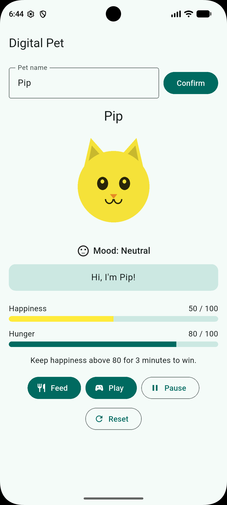
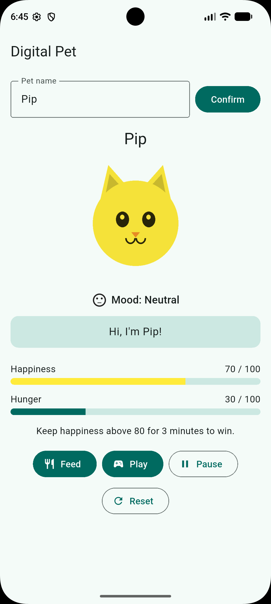
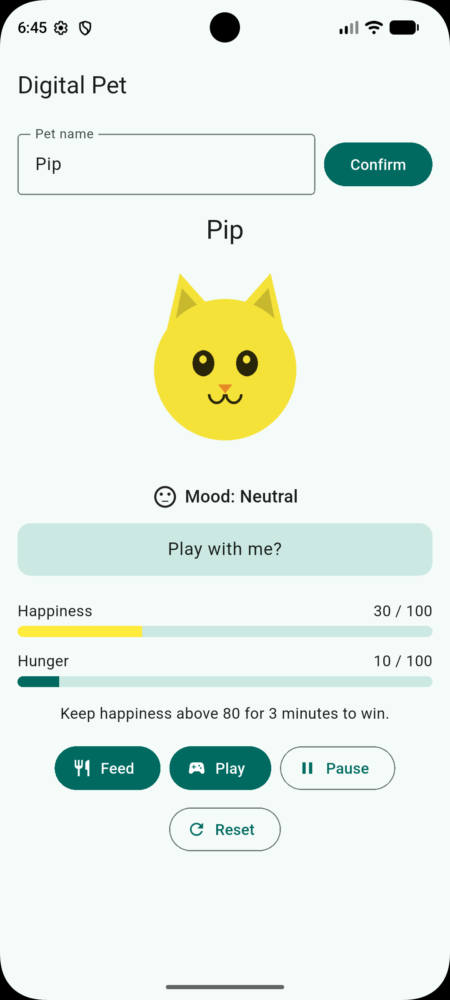
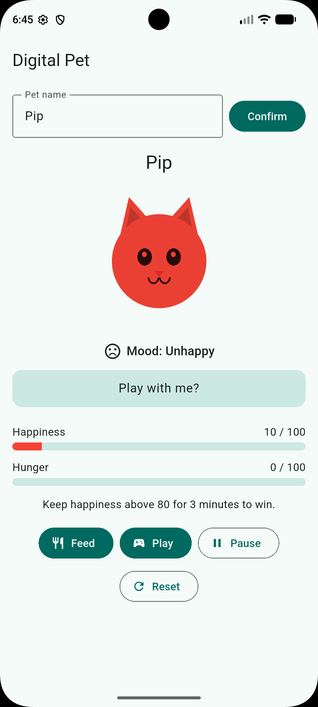
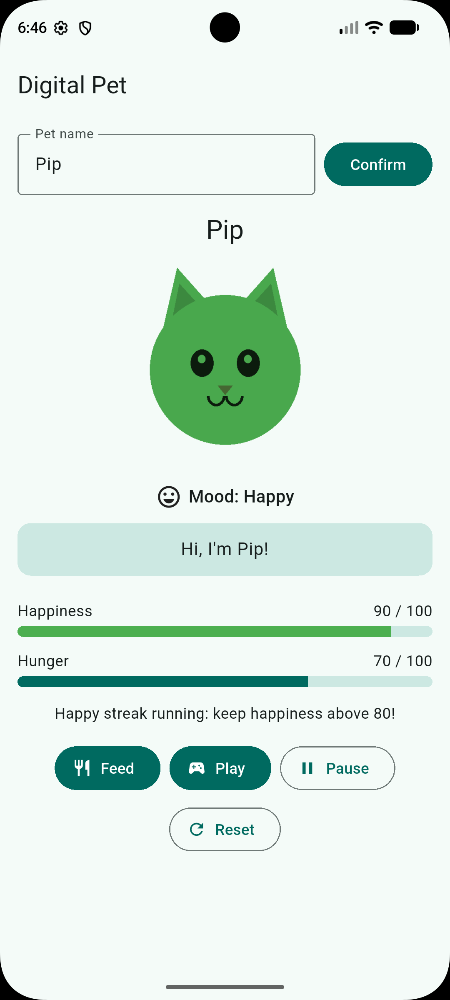
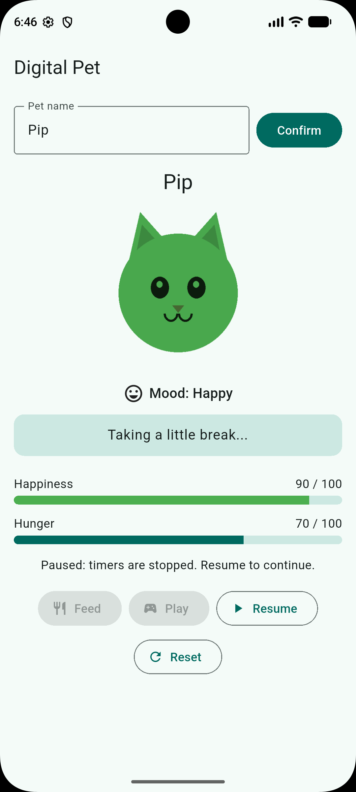
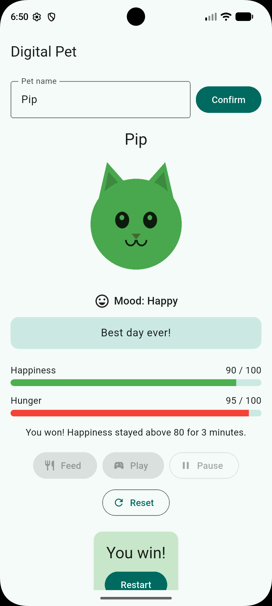

# Digital Pet — In-Class Activity 07

Mobile Application Development · Georgia State University · Due October 1, 2026

A Flutter pet-care app that turns user actions and time into visible state changes using `StatefulWidget`, `setState()`, lifecycle-aware timers, and accessible mood feedback.

## Developer and workstreams

Solo submission: Om Swaroop Reddy Udumula · Undergraduate pathway. Completed individually because I was absent from the in-class team session; both workstreams were implemented by me.

Both workstreams are tracked below; the combined change was built on the `feature/digital-pet` branch and merged through pull request #1:

| Workstream | Branch | Scope |
|---|---|---|
| Care Systems | `feature/digital-pet` | Care loop, bounded meters, hunger/win timers, outcomes, session controls |
| Pet Personality | `feature/digital-pet` | Derived messages, mood feedback, pet asset, motion/accessibility polish |

## Setup, run, test, build

```bash
git clone https://github.com/Omswaroopreddyudumula/digital-pet-activity07.git
cd digital-pet-activity07
flutter pub get
flutter analyze
flutter test
flutter run
flutter build apk --release
# output: build/app/outputs/flutter-apk/app-release.apk -> renamed DigitalPet_TeamName.apk
```

Asset registration in `pubspec.yaml` (under the existing `flutter:` section):

```yaml
flutter:
  uses-material-design: true
  assets:
    - assets/pet.png
```

## Game rules (team-chosen balance)

| Event | Effect |
|---|---|
| Feed | Hunger −10. If resulting hunger < 30, happiness −20 (overfed); otherwise happiness +10. |
| Play | Happiness +10, hunger +5. |
| Hunger tick (every 30 s) | Hunger +5. A tick that would push hunger above 100 clamps it to 100 and reduces happiness by 20. 95 → 100 has no penalty. |
| Win | Happiness strictly > 80 continuously for 3 minutes. Timer starts on first crossing above 80, is cancelled and cleared at 80 or below, and restarts fresh on the next crossing. |
| Loss | Hunger == 100 and happiness ≤ 10. |
| After win/loss | Feed, Play, Pause and pet-tap are disabled; both timers stop until Reset/Restart. |
| Reset | Restores happiness 50 / hunger 50 and outcome flags, cancels the win timer, starts exactly one new hunger timer. Pet name is kept. |
| Tapping the pet | Bounce animation only; does **not** change happiness, so it cannot make the win trivial. |

All meters are clamped to 0–100 through one `_clampMeter()` helper. `_updateOutcome()` runs after every action, tick, reset, and resume.

Mood thresholds (shared by label, icon, tint, scale, and message): > 70 Happy / green / scale 1.06; 30–70 Neutral / yellow / 1.0; < 30 Unhappy / red / 0.94.

## Advanced features (undergraduate: 2)

| Feature | User flow | State changes and why | PR |
|---|---|---|---|
| Session controls (pause/resume + restart) | Tap Pause → timers stop, actions disabled, message "Taking a little break...". Tap Resume → play continues. Restart button appears after win/loss. | `_isPaused` toggles. Pause cancels the hunger timer and the win timer so no state changes while paused. Resume starts one fresh hunger timer and re-runs `_updateOutcome()`, starting a **new** 3-minute streak (pausing breaks "continuous"). | [#1](https://github.com/Omswaroopreddyudumula/digital-pet-activity07/pull/1) |
| Visual polish & accessible motion (bundle = 1 feature) | Feed/Play/tap → pet bounces; meters glide; mood and speech crossfade; tint and size change at thresholds. | Bounce uses short-lived `_bounce` with a cancellable timer; message, tint, scale, mood are getters derived from `_happiness`/`_hunger`/outcome flags, never stored. `MediaQuery.disableAnimations` switches all durations to zero and skips the bounce. | [#1](https://github.com/Omswaroopreddyudumula/digital-pet-activity07/pull/1) |

Effects implemented: action bounce (`AnimatedScale`), living meters (`TweenAnimationBuilder`), expression switch (`AnimatedSwitcher` + `ValueKey`), mood tint & size, derived pet speech, reduced-motion support.

## Feature-to-learning-outcome map

| Feature | Learning outcome | Evidence |
|---|---|---|
| Core care loop | `setState()` notifies Flutter after an action; related fields updated together | Feed/Play before/after values (test matrix) |
| Bounded meters | Values kept within defined ranges; UI derived from same state | Boundary rows in test matrix |
| Hunger + win timers | Periodic work started in `initState()`, cancelled in `dispose()` | Leave-screen test; `flutter test` disposes tree with no pending timers |
| Session controls | Timer lifecycle handled safely across pause/resume | Pause/resume test rows |
| Animated bounce | Delayed callbacks respect lifecycle (`mounted`, cancel previous) | Rapid-tap demo, no console errors |
| Mood tint and size | Color/scale derive from happiness with same thresholds as label | 29/30/70/71 screenshots |
| Smooth meters | `build()` reads state-derived values without side effects | Before/after screenshot |
| Reduced motion | Interaction usable with motion disabled | Demo with setting on and off |

## Manual test matrix

Manual rows were tested on the release APK installed on a Pixel 8 (API 37.2) emulator; screenshots are in [`screenshots/`](screenshots/). Rows marked *automated* are verified by widget tests.

| Scenario | Expected | Observed | Pass? |
|---|---|---|---|
| Happiness 70 | Neutral, yellow, normal size | Happiness 70, hunger 30: "Mood: Neutral", yellow tint (`02_neutral_70.png`) | ✅ |
| Happiness 30 | Neutral, yellow; "Play with me?" (≤ 30) | Happiness 30, hunger 10: "Mood: Neutral", yellow, "Play with me?" (`03_neutral_30.png`) | ✅ |
| Happiness 29 / 71 | Unhappy-red-0.94 / Happy-green-1.06 | Not reachable with buttons (steps of 10); verified by `test/mood_threshold_test.dart` (29, 30, 70, 71 all pass) | ✅ |
| Happiness 10 | Unhappy, red, smaller | Happiness 10, hunger 0 after Feed ×5 (overfed): "Mood: Unhappy", red, smaller pet (`04_unhappy_10.png`) | ✅ |
| Happiness above 80 | Happy, green, larger; win streak starts | Happiness 90, hunger 70 after Play ×4: "Mood: Happy", green, "Happy streak running" (`05_happy_90.png`) | ✅ |
| Pause | Timers stop; Feed/Play disabled | "Paused: timers are stopped", Feed/Play greyed out, Resume shown (`06_paused.png`) | ✅ |
| Happiness > 80 for 3:00 after resume | Win; actions disabled | Win at happiness 90: "You win!", "Best day ever!", Feed/Play/Pause disabled, Restart shown (`07_win.png`) | ✅ |
| Hunger timer | +5 every 30 s | Hunger rose from 50 to 80 while idle with happiness unchanged (`01_neutral_50.png`) | ✅ |
| Release APK installed on device | Launches; actions work | Installed with `flutter install`; Feed, Play, Pause/Resume, Reset all work | ✅ |
| Feed at hunger 5 | Hunger clamps to 0; resulting hunger < 30 → happiness −20 | 50/5 → happiness 30, hunger 0 (automated: `game_rules_test.dart`) | ✅ |
| Feed at hunger 95 | Hunger −10; happiness +10 | 50/95 → happiness 60, hunger 85 (automated) | ✅ |
| Play at happiness 95 | Clamped to 100 | 95/50 → happiness 100, hunger 55 (automated) | ✅ |
| > 80 for 2:59, then drops to 80 | No win; streak cancelled | Happiness 100 for 2:59, Feed drops it to exactly 80; no win at the old 3:00 deadline, streak text cleared (automated) | ✅ |
| Rises above 80 again for 3:00 | Fresh timer; win at 3:00 | Play → 90; no win at 2:59, win at 3:00 (automated) | ✅ |
| Win stops the hunger timer | Meters frozen after win | Meters unchanged 90 s after win; Feed/Play disabled (automated) | ✅ |
| Hunger 95 → 100, then another tick | No penalty, then −20 happiness | 50/95 → tick → 50/100 → tick → 30/100 (automated) | ✅ |
| Hunger 100 and happiness ≤ 10 | Game over; actions disabled | 30/100 → overflow tick → 10/100: "Game over", "I need a rest.", Feed/Play disabled, meters frozen for 2 more minutes (automated) | ✅ |
| Leave screen / close app with timer running | No "setState() called after dispose()" | Covered by automated tests (screen disposed with no pending timers) | ✅ |
| Reduced motion off | Bounce plays | Feed → pet scale 1.12, back to 1.0 after 180 ms (automated) | ✅ |
| Reduced motion on | No bounce; zero-duration animations; values still shown | Feed → scale stays 1.0; `AnimatedScale` and meter durations are zero; meters and mood label still shown (automated) | ✅ |

### Automated tests

```
flutter test
```

- `test/widget_test.dart`: Feed updates hunger 50 → 40 and happiness 50 → 60; the screen disposes with no pending timers.
- `test/mood_threshold_test.dart`: happiness 29 / 30 / 70 / 71 produce the correct label, `ColorFiltered` tint, and scale.
- `test/game_rules_test.dart`: feed/play boundaries, hunger overflow, win cancel and restart, win at 3:00, game over, and motion on/off. Uses Flutter's fake clock so the 30-second ticks and 3-minute win run instantly.

Result: all 14 tests pass.

## Screenshots

| Neutral (50) | Neutral (70) | Neutral (30) | Unhappy (10) |
|---|---|---|---|
|  |  |  |  |

| Happy (90) | Paused | Win |
|---|---|---|
|  |  |  |

## Workflow evidence

- Pull request: [#1 feat: digital pet care loop, session controls, visual polish](https://github.com/Omswaroopreddyudumula/digital-pet-activity07/pull/1), merged into `main` after `flutter analyze` (no issues) and `flutter test` (all passed).
- Issues: [#2 Care systems](https://github.com/Omswaroopreddyudumula/digital-pet-activity07/issues/2), [#3 Pet personality](https://github.com/Omswaroopreddyudumula/digital-pet-activity07/issues/3), both completed in #1.

## Asset attribution

`assets/pet.png` — original artwork created for this project (no third-party license). Light/near-white so `BlendMode.modulate` shows the mood tint clearly. If the asset is missing, the app falls back to a tinted `Icons.pets` icon.

## Design note

Timer ownership: both timers live in the pet screen's `State` because they drive that screen's state and must be cancelled with it in `dispose()`. Pause cancels both timers instead of skipping ticks, so nothing changes while paused. The trade-off is that resuming restarts the 30-second interval and the 3-minute streak, which is stricter for the player but keeps "continuous" easy to reason about and test.
